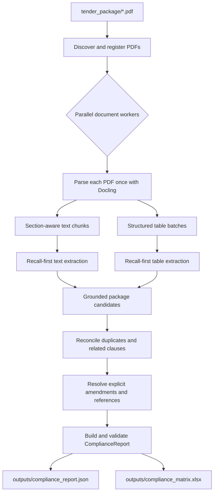
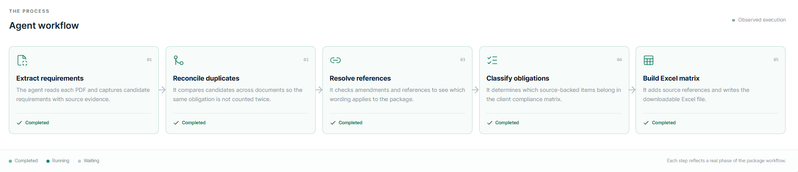
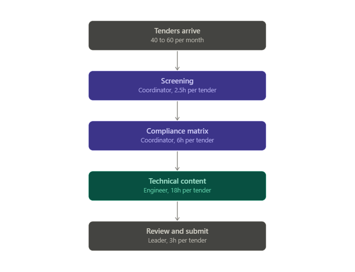
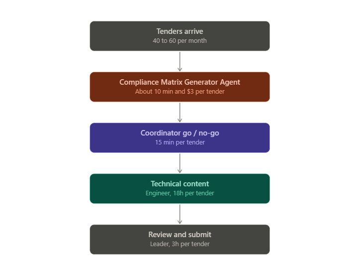

# Compliance Matrix AI Agent

This agent analyzes a complete solicitation package and produces one reconciled
compliance report. Extraction favors recall within the client's bid-readiness
scope: uncertain but source-supported checks remain candidates. Later stages merge duplicates,
connect supporting clauses, apply explicit amendments, match incorporated
references, preserve contradictions, and flag unresolved items for human review.

The JSON report is the authoritative output. The Excel workbook is a concise,
traceable view of that validated report for proposal teams.

## Client matrix scope

The matrix is for bidder eligibility, responsive submission, and specified
capability or coverage prerequisites. It looks for professional authorization,
certifications and quality systems; insurance and bonding; deadlines, submission
method, validity, signatures, and declarations; personnel qualifications,
clearances, language capability, and resumes; project experience; and required
proposal formats, forms, plans, disclosures, and relevant bid instructions.
These are kinds of checks, not fixed wording, amounts, or an 18-row target.

The agent should also retain a plausible new check with the same bid-readiness
purpose when the tender supports it, marking uncertain applicability for human
review. Routine payment terms, change-order clauses, generic performance duties,
reference lists, and individual unit-price rows are outside the matrix unless
they impose a distinct check within this scope. A referenced document is attached
to the applicable check; its mere listing is not a separate requirement.

Model output still requires evidence review. The pipeline benchmark below was
produced before this scope change. The extraction-quality evaluation was scored
against a ground truth built on the client's target requirement types.

## Project layout

The agent and its command-line entry point live in `app/`. The dashboard
frontend and its FastAPI adapter live together in `dashboard/`:

| Folder | Contents |
| --- | --- |
| `app/` | Agent graph, package discovery, compliance report and Excel modules, CLI entry point |
| `app/scripts/` | Docling table export example |
| `dashboard/` | Next.js frontend and `api/` FastAPI adapter |
| `evals/` | `source-of-truth.json`: ground truth, item-level matches, and scores |
| `notebooks/` | Original exploratory `agent.ipynb` notebook |
| `docs/images/` | Workflow diagrams used in this README |
| `tender_package/` | Input solicitation PDFs |
| `outputs/` | Generated reports and dashboard runs |
| `tables/` | Existing extracted table artifacts |
| `tests/` | Unit and integration tests |
| `skills/` | Project-specific agent instructions |

Keep `AGENTS.md`, dependency files, and environment configuration at the root.

`app/scripts/export_tables.py` is an example with an external sample PDF path
that must be configured before use.

When using `notebooks/agent.ipynb`, set the notebook working directory to the
project root. Its original `tender.pdf` / `tender.PDF` references still need to
point to an available PDF; current package PDFs live in `tender_package/`.
The notebook's `tender.md` reference is relative to the project root and may
create that file when its conversion cell runs.

## Architecture



Every candidate retains its source document and evidence. The final matrix is
created only after package-level reconciliation; it is never built directly
from chunk-worker output.

## Setup

Requirements:

- Python 3.12 or later
- `uv`
- an OpenAI API key
- an OpenAI model that supports structured output

Install the locked dependencies:

```powershell
uv sync
```

Copy `.env.example` to `.env`, then set your own values:

```dotenv
OPENAI_API_KEY=your-api-key
OPENAI_MODEL=your-model-name
```

Model calls send extracted solicitation content to the configured provider and
may incur usage charges.

## Run a solicitation package

Put every solicitation PDF in:

```text
tender_package/
```

The runner reads visible PDF files from the top level of that folder in
deterministic filename order. It does not scan subfolders.

Run the complete pipeline:

```powershell
uv run python -m app.run_package
```

Optional paths and concurrency controls are available:

```powershell
uv run python -m app.run_package --package "C:\path\to\package" --json-output "outputs\compliance_report.json" --xlsx-output "outputs\compliance_matrix.xlsx" --model "your-model-name" --document-workers 4 --graph-concurrency 4
```

`--model` overrides `OPENAI_MODEL` from `.env` for that run only.

The default output files are:

```text
outputs/compliance_report.json
outputs/compliance_matrix.xlsx
```

The command prints processed and failed document counts, the number of final
requirements, and the absolute artifact paths.

## Live dashboard

For a client demonstration, start the API and the frontend in two terminals:

```powershell
uv run uvicorn dashboard.api.app:app --port 8000
```

```powershell
cd dashboard
npm install
npm run dev
```

Open <http://localhost:3000>. The dashboard runs the sample solicitation
package, shows observed processing stages and document activity, and offers the
Excel compliance matrix for download after completion. Runs are written under
`outputs/dashboard_runs/` and do not overwrite the CLI's default outputs. Run
history is held in memory and is lost when the API restarts.

The dashboard's workflow view shows the agent's five phases. Each card is marked
Waiting, Running, or Completed as the run progresses:

1. **Extract requirements:** read each PDF and capture candidate requirements
   with source evidence.
2. **Reconcile duplicates:** compare candidates across documents so the same
   obligation is not counted twice.
3. **Resolve references:** check amendments and references to see which wording
   applies to the package.
4. **Classify obligations:** decide which source-backed items belong in the
   client compliance matrix.
5. **Build Excel matrix:** add source references and write the downloadable
   Excel file.



The frontend calls `http://127.0.0.1:8000` by default; set
`NEXT_PUBLIC_API_BASE_URL` in `dashboard/.env.local` to use another address.
API settings such as the model, CORS origin, and concurrency default to the
values in `dashboard/api/config.py` and can be overridden with environment
variables.

## Output structure

`ComplianceReport` contains:

- solicitation metadata when it can be determined without conflict;
- a calculated package summary;
- the document register, including processing failures;
- final reconciled requirements with structured parameters;
- ambiguity, contradiction, amendment, activity, and human-review flags;
- all retained evidence and external-reference match results; and
- unresolved package issues.

A shortened example:

```json
{
  "solicitation_number": "SOL-2026-17",
  "solicitation_title": "Bridge Engineering Services",
  "documents_analyzed": [
    {
      "document_id": "DOC-0123456789AB",
      "filename": "main_solicitation.pdf",
      "document_type": "MAIN_SOLICITATION",
      "processing_status": "COMPLETE"
    }
  ],
  "summary": {
    "documents_processed": 1,
    "documents_failed": 0,
    "total_requirements": 1,
    "mandatory_requirements": 1,
    "disqualifying_requirements": 1,
    "ambiguous_requirements": 0,
    "contradictory_requirements": 0,
    "external_references_found": 0,
    "unresolved_external_references": 0,
    "amendments_found": 0,
    "unresolved_amendments": 0,
    "human_review_required": 0
  },
  "requirements": [
    {
      "item_id": "REQ-0001",
      "requirement": {
        "text": "Provide bid security equal to 10% of the bid price.",
        "category": "bonding_security",
        "extraction_status": "FOUND",
        "requirement_type": "MANDATORY",
        "required_at": "BID_SUBMISSION",
        "compliance_severity": "DISQUALIFYING",
        "parameters": {"bid_security": "10% of bid price"}
      },
      "analysis": {
        "version_status": "CURRENT",
        "is_active": true,
        "requires_human_review": false
      },
      "sources": {
        "evidence": [
          {
            "document_id": "DOC-0123456789AB",
            "document_name": "main_solicitation.pdf",
            "section": "2.6",
            "page": 6,
            "text": "Bid security equal to 10% of the bid price is required."
          }
        ],
        "external_references": []
      }
    }
  ],
  "unresolved_issues": []
}
```

The example omits optional fields for readability. The saved JSON includes the
complete validated schema.

The Excel workbook contains four worksheets:

1. **Compliance Matrix** — the Firm's eight-column layout: Item, Requirement
   (from RFP), Sec., M/R, Resp., Status, Pg, and Comments. It includes active
   actionable obligations; Resp. and Status are left blank for the bid team.
   M/R is always Mandatory or Required. Conditional duties appear as Required
   with an applicability note in Comments. Source issues and missing section or
   page coordinates are also shown in Comments rather than guessed. New runs
   recover page numbers from table provenance or a unique PDF evidence match;
   any page that cannot be verified remains blank and is flagged in Comments.
2. **Requirement Details** — repeated evidence rows using stable requirement IDs.
3. **Issues - Human Review** — unresolved or material issues. Excel worksheet
   names cannot contain `/`, so this is the workbook-safe form of
   “Issues / Human Review.”
4. **Document Register** — every PDF, its inferred type, status, and requirement
   count.

The client matrix follows the Firm's simple grey-header format. Text fields
wrap, headers are frozen and filterable, and source text is neutralized before
writing so it cannot become an Excel formula.

## Validation

Fast offline checks use deterministic fake parsers and models:

```powershell
uv run pytest tests/unit/
uv run pytest tests/integration/
uv run ruff check .
uv run ruff format --check .
```

The package integration suite verifies:

- an amendment that replaces an earlier requirement while preserving evidence;
- a reference matched to an uploaded package document;
- two missing referenced documents that remain visible for review; and
- contradictory requirement timing across separate PDFs.

## Project results and business case

The following 2025 tender-volume, loss, staffing, and cost figures were supplied
for this project; they have not been independently audited here. The pipeline
timings and token costs below describe **one supplied benchmark run**, not an
average across tenders. The extraction-quality scores are recorded in
`evals/source-of-truth.json` for one tender.

### 2025 bid activity and current effort

| Stage | Count | Share |
|---|---:|---:|
| Tenders received and screened | 612 | 100% of received |
| Discarded at screening | 518 | 84.6% of received |
| Bids submitted | 94 | 15.4% of received |
| Bids not won | 71 | 75.5% of submitted |
| Bids won | 23 | 24.5% of submitted |

Wins represent 3.8% of tenders received. In the supplied loss-log sample, two
bids were lost for non-compliance, representing $3,180,000 in contract value;
four were lost on price (value not provided), and two on team experience
($3,070,000). The agent addresses requirement discovery and review, not pricing
competitiveness or the bidder's experience.

| Activity | Calculation | Annual hours | Annual cost |
|---|---:|---:|---:|
| Coordinator screening | 612 × 2.5 hours | 1,530 | $79,560 |
| Coordinator compliance matrices | 94 × 6 hours | 564 | $29,328 |
| **Coordinator total** | 2,094 hours × $52/hour | **2,094** | **$108,888** |
| Engineer technical content | 94 × 18 hours × $145/hour | 1,692 | $245,340 |

Across three coordinators, the baseline is 698 hours each per year on screening
and matrices. The two sample non-compliance losses consumed an estimated 59
team hours before rejection: 36 engineer hours, 17 coordinator hours, and six
leader hours. No rate was supplied for leader time.

### Current and proposed workflow

The supplied diagrams compare the existing tender workflow with the proposed
agent-assisted workflow. The proposed 10-minute run, $3 model cost, and
15-minute coordinator review are planning assumptions based on one test run,
not measured averages across all tenders.

**Current workflow**



**Proposed agent-assisted workflow**



### Single-tender pipeline benchmark

The supplied run used one PDF, `gpt-5.6-sol`, and graph concurrency of four.
The saved report contains 85 final rows. The reported total was 578.79 seconds
(about 9 minutes 39 seconds) and $2.6553 in model cost.

| Stage | Wall-clock time | Share of total | Notes |
|---|---:|---:|---|
| Docling parsing | 61.83 s | 10.7% | No model calls |
| Chunk analysis | 106.84 s | 18.5% | Shared parallel window with table analysis; 54 calls |
| Table analysis | Included above | — | Five parallel calls |
| Reconciliation | 178.57 s | 30.9% | One model call |
| Coverage audit | 39.18 s | 6.8% | One model call |
| Report generation | 192.07 s | 33.2% | Eight sequential model calls |
| Save JSON and Excel | 0.19 s | <0.1% | Local export |
| **Total** | **578.79 s** | **100%** | Includes approximately 0.11 s of other overhead |

| Model stage | Tokens | Cost |
|---|---:|---:|
| Chunk extraction | 88,200 | $0.7835 |
| Table extraction | 16,452 | $0.2060 |
| Reconciliation | 50,578 | $0.5357 |
| Coverage audit | 76,345 | $0.4474 |
| Report summary | 87,459 | $0.6827 |
| **Total** | **319,034** | **$2.6553** |

Reconciliation and report generation account for about 64% of reported wall
time. Parallelizing the sequential report calls is a potential optimization,
not a measured improvement. At 85 rows, this test cost about $0.031 per row;
the scenario below budgets $3 per tender to allow for variation.

### Extraction quality on the test tender

The agent's output for `tender.PDF` (solicitation EF997-130359/A) was compared
with a ground truth of 16 requirements covering the client's target requirement
types. The full item-by-item comparison is in `evals/source-of-truth.json`.

We scored it on three standard measures:

- **Recall** is the share of ground-truth requirements the agent found. It
  answers "did it miss anything?"
- **Precision** is the share of the agent's output that matched a ground-truth
  requirement. It answers "how much of what it returned was useful?"
- **F1** combines the two into one score that is pulled toward the weaker of
  them, so an agent only scores well if it is both complete and focused.

**Recall: 100%** (16 of 16 ground-truth requirements found)

**Precision: 59.1%** (26 of 44 agent items matched the ground truth)

**F1: 0.74**

The agent found all 16 requirements, so a bid team relying on it would not have
missed a compliance obligation in this tender. Two of the 16 were only partly
captured: the insurance item omits that the contractor bears deductibles, and
the bid security item omits Bid Bond form 504 and Treasury Board Appendix L.

The other 18 agent items fell outside the target scope. Examples are SI12
rejection grounds, clauses named only in the table of contents, and
informational notes. These rows add review effort but are not missed
obligations.

These results come from one tender and do not establish performance across
other solicitations.

### Illustrative savings scenario

The proposed workflow has the agent generate a matrix, then a coordinator
review it and make the go/no-go decision. Assuming every one of the 612 tenders
takes 15 minutes of coordinator review and costs $3 in model usage:

| Outcome | Calculation | Annual scenario |
|---|---:|---:|
| Coordinator time freed | 2,094 − (612 × 0.25) hours | **1,941 hours** |
| New coordinator and model cost | 153 hours × $52 + 612 × $3 | **$9,792** |
| Value of coordinator time freed, net of model cost | $108,888 − $9,792 | **$99,096** |

If preventing the two sample non-compliance losses also freed 36 engineer
hours, those hours could fund two additional bids at 18 hours each. Applying
the observed 23/94 bid win rate gives about 0.49 expected wins per year. At an
**assumed** $1,067,167 average contract value, that is about $522,230 in
expected contract revenue, not profit. The $5,220 value of the 36 engineer
hours is not added again because those hours are assumed to be redeployed.

This is a planning scenario, not an observed outcome. The 15-minute review
time, $3 cost across larger packages, prevention of non-compliance losses, and
engineer redeployment all require testing across more tenders. Freed
coordinator time becomes a cash saving only if it changes spending or staffing.

## Limits and review boundary

- The pipeline does not decide whether the company should bid and does not infer
  bidder capabilities.
- External references are matched only against PDFs in the package; missing
  documents are not downloaded.
- LLM extraction and reconciliation are probabilistic. Review disqualifying,
  ambiguous, contradictory, amendment-related, and missing-reference items
  against the source PDFs before submission.
- Image-only or unusually structured PDFs may require OCR or manual review.
- A failed PDF remains in the document register and creates a processing issue;
  it does not silently disappear.
