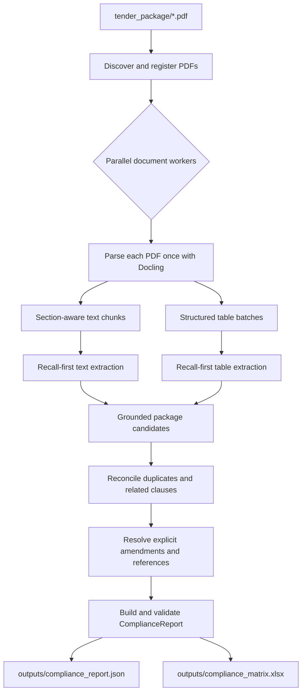
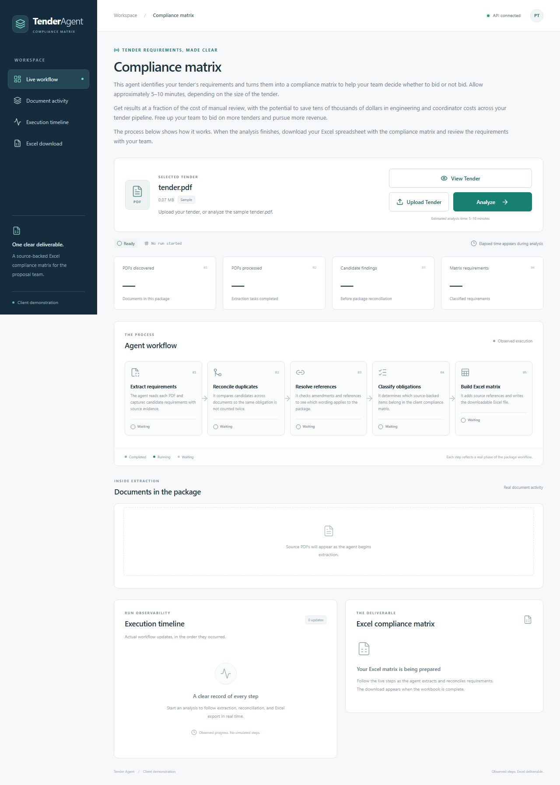

<div align="center">

# 📋 Compliance Matrix AI Agent

**Turn tender PDFs into a traceable Excel compliance matrix.**

Read the requirements. Follow the analysis. Give your bid team a clearer starting point.


<a href="#quickstart">Quickstart</a> ·
<a href="#dashboard">Dashboard</a> ·
<a href="#how-it-works">How it works</a> ·
<a href="#outputs">Outputs</a> ·
<a href="#results">Results</a> ·
<a href="#project-layout">Project layout</a>

</div>

---

The Compliance Matrix AI Agent reads tender PDFs, extracts requirements with
source evidence, reconciles related findings, and produces an Excel workbook
for proposal teams. Use the dashboard to analyze one PDF, or the command-line
runner to review a complete solicitation package.

The agent helps your team assess requirements for a bid/no-bid decision.
The validated JSON report is the authoritative output; the Excel matrix gives
the bid team a practical place to assign responsibilities and track compliance.

<a id="features"></a>

## ✨ What you can do

| Capability | What it gives your team |
| --- | --- |
| 📤 Upload a tender | Analyze your own PDF or try the bundled sample |
| 👀 View the source | Open the selected tender before starting the analysis |
| 🧭 Follow the workflow | Watch real processing stages and document activity |
| 🔎 Trace requirements | Review supporting evidence, sections, and verified page references |
| 🧩 Reconcile a package | Merge related findings and check explicit amendments across PDFs with the CLI |
| ⚠️ Review uncertainty | Keep contradictions, missing references, and ambiguous items visible |
| 📊 Download Excel | Get the compliance matrix, evidence details, review issues, and document register |

<a id="how-it-works"></a>

## 🧠 How it works


| Stage | What happens |
| --- | --- |
| **1. Extract requirements** | Parse each PDF and capture candidates from text and tables with source evidence |
| **2. Reconcile duplicates** | Combine related clauses so the same obligation is not counted twice |
| **3. Resolve references** | Check explicit amendments and references against documents in the package |
| **4. Classify obligations** | Decide which supported findings belong in the client compliance matrix |
| **5. Build Excel matrix** | Validate the report and write the downloadable workbook |

Extraction favors recall within the client's bid-readiness scope. Uncertain,
source-supported candidates remain available for later reconciliation and review.

<details>
<summary><strong>🏗️ Explore the technical architecture</strong></summary>



Every candidate retains its source document and evidence. The final matrix is
created only after package-level reconciliation; it is never built directly
from chunk-worker output.

</details>

<details>
<summary><strong>🎯 See which requirements belong in the matrix</strong></summary>

The matrix is for bidder eligibility, responsive submission, and specified
capability or coverage prerequisites. It looks for professional authorization,
certifications and quality systems; insurance and bonding; deadlines, submission
method, validity, signatures, and declarations; personnel qualifications,
clearances, language capability, and resumes; project experience; and required
proposal formats, forms, plans, disclosures, and relevant bid instructions.
These are kinds of checks, not fixed wording, amounts, or an 18-row target.

The agent should also retain a plausible new check with the same bid-readiness
purpose when the tender supports it, marking uncertain applicability for human
review. Routine payment terms, change-order clauses, generic performance duties,
reference lists, and individual unit-price rows are outside the matrix unless
they impose a distinct check within this scope. A referenced document is attached
to the applicable check; its mere listing is not a separate requirement.

Model output still requires evidence review. The pipeline benchmark below was
produced before this scope change. The extraction-quality evaluation was scored
against a ground truth built on the client's target requirement types.

</details>

<a id="quickstart"></a>

## 🚀 Quickstart

### 🛠️ Requirements

- Python 3.12 or later
- `uv`
- an OpenAI API key
- an OpenAI model that supports structured output

### 📦 Install the Python dependencies

From the project root, install the locked dependencies:

```powershell
uv sync
```

### 🔑 Configure the model

Copy [.env.example](.env.example) to `.env`, then set your own values:

```dotenv
OPENAI_API_KEY=your-api-key
OPENAI_MODEL=your-model-name
```

Model calls send extracted solicitation content to the configured provider and
may incur usage charges.

<a id="dashboard"></a>

## 🖥️ Live dashboard

### 🖥️ Start the dashboard

Start the API and frontend in two terminals from the project root.

**Terminal 1 — API**

```powershell
uv run uvicorn dashboard.api.app:app --port 8000
```

**Terminal 2 — frontend**

```powershell
cd dashboard
npm install
npm run dev
```

Open <http://localhost:3000>. The dashboard analyzes `tender_package/tender.PDF`
or a user-uploaded PDF, shows observed processing stages and document activity, and offers the
Excel compliance matrix for download after completion. Runs are written under
`outputs/dashboard_runs/` and do not overwrite the CLI's default outputs. Run
history is held in memory and is lost when the API restarts.

### 📤 Analyze a tender

Click **View Tender** to read the selected document. Choose **Upload Tender**
to select your own PDF, then click **Analyze**. Without an upload, **Analyze**
uses the bundled `tender.pdf` only. **Use sample tender** clears your selection.
The selected upload survives a page refresh within the same browser session.

**Typical planning estimate:** allow 5–10 minutes, depending on tender size.
Actual runtime varies with parsing and model execution.
Counters at the top track PDFs discovered, PDFs processed,
candidate findings, and matrix requirements. The sidebar links to the live
workflow, document activity, execution timeline, and Excel download.

<details>
<summary><strong>🖼️ View the dashboard screenshot</strong></summary>



</details>

<details>
<summary><strong>⚙️ Connection, upload limits, and retention</strong></summary>

The frontend calls `http://127.0.0.1:8000` by default; set
`NEXT_PUBLIC_API_BASE_URL` in `dashboard/.env.local` to use another address.
API settings such as the model, CORS origin, and concurrency default to the
values in `dashboard/api/config.py` and can be overridden with environment
variables.

Uploads accept readable, unencrypted PDFs, with defaults of 20 MiB and 300 pages.
Override these using `DEMO_MAX_UPLOAD_BYTES` and `DEMO_MAX_UPLOAD_PAGES`.
`DEMO_MAX_UPLOADS` bounds retained uploads (default 100). The API returns opaque
upload IDs and never accepts client filesystem paths. Each analysis gets an
isolated input folder and workbook. Temporary upload IDs expire with run
retention; unreferenced uploads are pruned during API activity. Run folders and
their copied inputs remain on disk under `outputs/dashboard_runs/` and need an
operational cleanup policy for hosted use. This remains a single-process local
demo; public hosting needs admission/usage controls to bound provider spending
and a suitable retention policy for uploaded documents.

</details>

<a id="cli"></a>

## 📂 Analyze a complete solicitation package

Put every solicitation PDF in:

```text
tender_package/
```

The runner reads visible PDF files from the top level of that folder in
deterministic filename order. It does not scan subfolders.

Run the complete pipeline:

```powershell
uv run python -m app.run_package
```

<details>
<summary><strong>⚙️ Custom paths and concurrency</strong></summary>

Optional paths and concurrency controls are available:

```powershell
uv run python -m app.run_package --package "C:\path\to\package" --json-output "outputs\compliance_report.json" --xlsx-output "outputs\compliance_matrix.xlsx" --model "your-model-name" --document-workers 4 --graph-concurrency 4
```

`--model` overrides `OPENAI_MODEL` from `.env` for that run only.

</details>

The default output files are:

```text
outputs/compliance_report.json
outputs/compliance_matrix.xlsx
```

The command prints processed and failed document counts, the number of final
requirements, and the absolute artifact paths.

<a id="outputs"></a>

## 📊 What you get

`ComplianceReport` contains:

- solicitation metadata when it can be determined without conflict;
- a calculated package summary;
- the document register, including processing failures;
- final reconciled requirements with structured parameters;
- ambiguity, contradiction, amendment, activity, and human-review flags;
- all retained evidence and external-reference match results; and
- unresolved package issues.

<details>
<summary><strong>🧾 View an example JSON report</strong></summary>

A shortened example:

```json
{
  "solicitation_number": "SOL-2026-17",
  "solicitation_title": "Bridge Engineering Services",
  "documents_analyzed": [
    {
      "document_id": "DOC-0123456789AB",
      "filename": "main_solicitation.pdf",
      "document_type": "MAIN_SOLICITATION",
      "processing_status": "COMPLETE"
    }
  ],
  "summary": {
    "documents_processed": 1,
    "documents_failed": 0,
    "total_requirements": 1,
    "mandatory_requirements": 1,
    "disqualifying_requirements": 1,
    "ambiguous_requirements": 0,
    "contradictory_requirements": 0,
    "external_references_found": 0,
    "unresolved_external_references": 0,
    "amendments_found": 0,
    "unresolved_amendments": 0,
    "human_review_required": 0
  },
  "requirements": [
    {
      "item_id": "REQ-0001",
      "requirement": {
        "text": "Provide bid security equal to 10% of the bid price.",
        "category": "bonding_security",
        "extraction_status": "FOUND",
        "requirement_type": "MANDATORY",
        "required_at": "BID_SUBMISSION",
        "compliance_severity": "DISQUALIFYING",
        "parameters": {"bid_security": "10% of bid price"}
      },
      "analysis": {
        "version_status": "CURRENT",
        "is_active": true,
        "requires_human_review": false
      },
      "sources": {
        "evidence": [
          {
            "document_id": "DOC-0123456789AB",
            "document_name": "main_solicitation.pdf",
            "section": "2.6",
            "page": 6,
            "text": "Bid security equal to 10% of the bid price is required."
          }
        ],
        "external_references": []
      }
    }
  ],
  "unresolved_issues": []
}
```

The example omits optional fields for readability. The saved JSON includes the
complete validated schema.

</details>

### 📊 Your Excel workbook

The Excel workbook contains four worksheets:

1. **Compliance Matrix** — the Firm's eight-column layout: Item, Requirement
   (from RFP), Sec., M/R, Resp., Status, Pg, and Comments. It includes active
   actionable obligations; Resp. and Status are left blank for the bid team.
   M/R is always Mandatory or Required. Conditional duties appear as Required
   with an applicability note in Comments. Source issues and missing section or
   page coordinates are also shown in Comments rather than guessed. New runs
   recover page numbers from table provenance or a unique PDF evidence match;
   any page that cannot be verified remains blank and is flagged in Comments.
2. **Requirement Details** — repeated evidence rows using stable requirement IDs.
3. **Issues - Human Review** — unresolved or material issues. Excel worksheet
   names cannot contain `/`, so this is the workbook-safe form of
   “Issues / Human Review.”
4. **Document Register** — every PDF, its inferred type, status, and requirement
   count.

The client matrix follows the Firm's simple grey-header format. Text fields
wrap, headers are frozen and filterable, and source text is neutralized before
writing so it cannot become an Excel formula.

<a id="results"></a>

## 📈 Results and business case

The following 2025 tender-volume, loss, staffing, and cost figures were supplied
for this project; they have not been independently audited here. The pipeline
timings and token costs below describe **one supplied benchmark run**, not an
average across tenders. The extraction-quality scores are recorded in
[evaluation/source-of-truth.json](evaluation/source-of-truth.json) for one tender.

### 🔄 Current and proposed workflow

The supplied diagrams compare the existing tender workflow with the proposed
agent-assisted workflow. The proposed 10-minute run, $3 model cost, and
15-minute coordinator review are planning assumptions based on one test run,
not measured averages across all tenders.

<table>
  <tr>
    <th width="50%">📝 Current workflow</th>
    <th width="50%">🤖 Proposed agent-assisted workflow</th>
  </tr>
  <tr>
    <td></td>
    <td></td>
  </tr>
</table>

<details>
<summary><strong>📈 2025 bid activity and current effort</strong></summary>

| Stage | Count | Share |
|---|---:|---:|
| Tenders received and screened | 612 | 100% of received |
| Discarded at screening | 518 | 84.6% of received |
| Bids submitted | 94 | 15.4% of received |
| Bids not won | 71 | 75.5% of submitted |
| Bids won | 23 | 24.5% of submitted |

Wins represent 3.8% of tenders received. In the supplied loss-log sample, two
bids were lost for non-compliance, representing $3,180,000 in contract value;
four were lost on price (value not provided), and two on team experience
($3,070,000). The agent addresses requirement discovery and review, not pricing
competitiveness or the bidder's experience.

| Activity | Calculation | Annual hours | Annual cost |
|---|---:|---:|---:|
| Coordinator screening | 612 × 2.5 hours | 1,530 | $79,560 |
| Coordinator compliance matrices | 94 × 6 hours | 564 | $29,328 |
| **Coordinator total** | 2,094 hours × $52/hour | **2,094** | **$108,888** |
| Engineer technical content | 94 × 18 hours × $145/hour | 1,692 | $245,340 |

Across three coordinators, the baseline is 698 hours each per year on screening
and matrices. The two sample non-compliance losses consumed an estimated 59
team hours before rejection: 36 engineer hours, 17 coordinator hours, and six
leader hours. No rate was supplied for leader time.

</details>

<details>
<summary><strong>⏱️ Single-tender pipeline benchmark</strong></summary>

The supplied run used one PDF, `gpt-5.6-sol`, and graph concurrency of four.
The saved report contains 85 final rows. The reported total was 578.79 seconds
(about 9 minutes 39 seconds) and $2.6553 in model cost.

| Stage | Wall-clock time | Share of total | Notes |
|---|---:|---:|---|
| Docling parsing | 61.83 s | 10.7% | No model calls |
| Chunk analysis | 106.84 s | 18.5% | Shared parallel window with table analysis; 54 calls |
| Table analysis | Included above | — | Five parallel calls |
| Reconciliation | 178.57 s | 30.9% | One model call |
| Coverage audit | 39.18 s | 6.8% | One model call |
| Report generation | 192.07 s | 33.2% | Eight sequential model calls |
| Save JSON and Excel | 0.19 s | <0.1% | Local export |
| **Total** | **578.79 s** | **100%** | Includes approximately 0.11 s of other overhead |

| Model stage | Tokens | Cost |
|---|---:|---:|
| Chunk extraction | 88,200 | $0.7835 |
| Table extraction | 16,452 | $0.2060 |
| Reconciliation | 50,578 | $0.5357 |
| Coverage audit | 76,345 | $0.4474 |
| Report summary | 87,459 | $0.6827 |
| **Total** | **319,034** | **$2.6553** |

Reconciliation and report generation account for about 64% of reported wall
time. Parallelizing the sequential report calls is a potential optimization,
not a measured improvement. At 85 rows, this test cost about $0.031 per row;
the scenario below budgets $3 per tender to allow for variation.

</details>

### 🎯 Extraction quality on the test tender

The agent's output for `tender.PDF` (solicitation EF997-130359/A) was compared
with a ground truth of 16 requirements covering the client's target requirement
types. The full item-by-item comparison is in [evaluation/source-of-truth.json](evaluation/source-of-truth.json).

We scored it on three standard measures:

- **Recall** is the share of ground-truth requirements the agent found. It
  answers "did it miss anything?"
- **Precision** is the share of the agent's output that matched a ground-truth
  requirement. It answers "how much of what it returned was useful?"
- **F1** combines the two into one score that is pulled toward the weaker of
  them, so an agent only scores well if it is both complete and focused.

**Recall: 100%** (16 of 16 ground-truth requirements found)

**Precision: 59.1%** (26 of 44 agent items matched the ground truth)

**F1: 0.74**

The evaluation matched all 16 ground-truth requirements at least partly.
Two of the 16 were only partly captured: the insurance item omits that the contractor bears deductibles, and
the bid security item omits Bid Bond form 504 and Treasury Board Appendix L.

The other 18 agent items fell outside the target scope. Examples are SI12
rejection grounds, clauses named only in the table of contents, and
informational notes. These rows add review effort but are not missed
obligations.

These results come from one tender and do not establish performance across
other solicitations.

<details>
<summary><strong>💰 Illustrative savings scenario</strong></summary>

The proposed workflow has the agent generate a matrix, then a coordinator
review it and make the go/no-go decision. Assuming every one of the 612 tenders
takes 15 minutes of coordinator review and costs $3 in model usage:

| Outcome | Calculation | Annual scenario |
|---|---:|---:|
| Coordinator time freed | 2,094 − (612 × 0.25) hours | **1,941 hours** |
| New coordinator and model cost | 153 hours × $52 + 612 × $3 | **$9,792** |
| Value of coordinator time freed, net of model cost | $108,888 − $9,792 | **$99,096** |

If preventing the two sample non-compliance losses also freed 36 engineer
hours, those hours could fund two additional bids at 18 hours each. Applying
the observed 23/94 bid win rate gives about 0.49 expected wins per year. At an
**assumed** $1,067,167 average contract value, that is about $522,230 in
expected contract revenue, not profit. The $5,220 value of the 36 engineer
hours is not added again because those hours are assumed to be redeployed.

This is a planning scenario, not an observed outcome. The 15-minute review
time, $3 cost across larger packages, prevention of non-compliance losses, and
engineer redeployment all require testing across more tenders. Freed
coordinator time becomes a cash saving only if it changes spending or staffing.

</details>

<a id="project-layout"></a>

## 🗂️ Project layout

The agent and its command-line entry point live in `app/`. The dashboard
frontend and its FastAPI adapter live together in `dashboard/`:

| Folder | Contents |
| --- | --- |
| `app/` | Agent graph, package discovery, compliance report and Excel modules, CLI entry point |
| `app/scripts/` | Docling table export example |
| `dashboard/` | Next.js frontend and `api/` FastAPI adapter |
| `evaluation/` | `source-of-truth.json`: ground truth, item-level matches, and scores |
| `notebooks/` | Original exploratory `agent.ipynb` notebook |
| `docs/images/` | Dashboard screenshots and workflow diagrams used in this README |
| `tender_package/` | Input solicitation PDFs |
| `outputs/` | Generated reports and dashboard runs |
| `tables/` | Existing extracted table artifacts |
| `tests/` | Unit and integration tests |
| `skills/` | Project-specific agent instructions |

Keep `AGENTS.md`, dependency files, and environment configuration at the root.

`app/scripts/export_tables.py` is an example with an external sample PDF path
that must be configured before use.

When using `notebooks/agent.ipynb`, set the notebook working directory to the
project root. Its original `tender.pdf` / `tender.PDF` references still need to
point to an available PDF; current package PDFs live in `tender_package/`.
The notebook's `tender.md` reference is relative to the project root and may
create that file when its conversion cell runs.

<a id="validation"></a>

## 🧪 Validation

Fast offline checks use deterministic fake parsers and models:

```powershell
uv run pytest tests/unit/
uv run pytest tests/integration/
uv run ruff check .
uv run ruff format --check .
```

The package integration suite verifies:

- an amendment that replaces an earlier requirement while preserving evidence;
- a reference matched to an uploaded package document;
- two missing referenced documents that remain visible for review; and
- contradictory requirement timing across separate PDFs.

Frontend checks run from `dashboard/`:

```powershell
npm run typecheck
npm run lint
npm test
npm run build
```

The current legacy `tests/unit/test_demo_upload.py` imports the missing
`app.UI_frontend` module and prevents collection of the complete unit suite.
To run the available offline tests while that legacy import is unresolved:

```powershell
uv run pytest tests/unit/ tests/integration/ --ignore=tests/unit/test_demo_upload.py
```

<a id="review-boundary"></a>

## 🛡️ Limits and review boundary

- The pipeline does not decide whether the company should bid and does not infer
  bidder capabilities.
- External references are matched only against PDFs in the package; missing
  documents are not downloaded.
- LLM extraction and reconciliation are probabilistic. Review disqualifying,
  ambiguous, contradictory, amendment-related, and missing-reference items
  against the source PDFs before submission.
- Image-only or unusually structured PDFs may require OCR or manual review.
- A failed PDF remains in the document register and creates a processing issue;
  it does not silently disappear.
