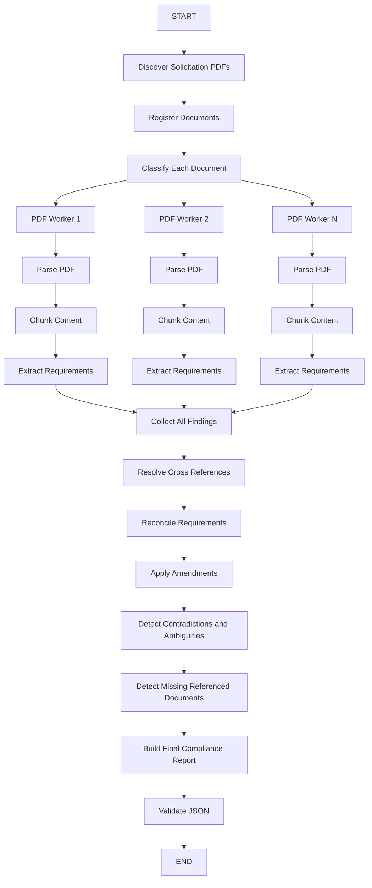

# PLAN.md

# Bid / No-Bid AI Agent Upgrade Plan

## Objective

Upgrade the existing Bid / No-Bid AI agent so it can analyze an entire solicitation package made up of multiple PDF documents, process those documents in parallel, reconcile requirements across all files, and produce one grounded JSON compliance report that can drive a compliance matrix and later support bid / no-bid decision support.

The system must treat an RFP as a **solicitation package**, not as a single PDF.

A solicitation package may contain:

- Main solicitation / RFP
- Annexes
- Appendices
- Technical specifications
- Pricing schedules
- Forms
- Security requirements
- Standard instructions
- Q&A documents
- Amendments
- Addenda
- Other referenced documents

For the local MVP, PDFs will be placed in a folder and the agent will discover and process every PDF in that folder. The architecture must also make it easy to replace folder discovery later with a frontend multi-file upload where a user selects several PDFs before clicking Submit.

The final result must be **one consolidated compliance report**, not one report per PDF.

---

# Core Product Principle

The output should separate two different concerns:

1. **Requirement**
   - What the solicitation actually says.
   - Grounded in source documents.
   - Includes section, page, evidence, timing, category, mandatory status, and structured requirement parameters.

2. **Analysis**
   - What the AI concludes after comparing related clauses across the package.
   - Includes ambiguity, contradictions, amendments, external references, missing documents, and human review requirements.

This separation must be reflected in the data models and final JSON.

---

# Current Compliance Matrix Target

The existing compliance matrix contains fields similar to:

| Field | Meaning |
|---|---|
| Item | Matrix row number |
| Requirement | Requirement extracted from RFP |
| Sec. | Section |
| M/R | Mandatory / Required |
| Pg | Page |

The upgraded agent must preserve the ability to generate this matrix while adding stronger AI analysis fields.

The JSON should be the system of record. A spreadsheet or frontend matrix should be a projection of that JSON.

---

# Target End-to-End Architecture



Use LangGraph fan-out / fan-in patterns where appropriate. If the current project already uses `Send`, reducers, or another map-reduce pattern, extend that architecture instead of replacing working code unnecessarily.

---

# Important Architectural Rule

Do **not** create an independent final compliance matrix for each PDF and concatenate the rows.

That would cause:

- Duplicate requirements
- Conflicting requirements
- Old requirements surviving after amendments
- Related clauses being split into separate rows
- Cross-document references being missed
- Incomplete requirements being treated as complete

Instead:

```text
Each PDF
   -> extract candidate findings
   -> preserve source identity
   -> collect all findings
   -> globally reconcile findings
   -> produce one authoritative compliance report
```

The final reconciliation stage is a core part of the product.

---

# Phase 0: Inspect Existing Repository Before Changing Anything

Before implementing changes:

1. Inspect the current repository structure.
2. Identify the current LangGraph graph.
3. Identify:
   - State schema
   - Existing PDF parser
   - Existing chunking logic
   - Existing map workers
   - Existing table extraction
   - Existing reducers
   - Existing Pydantic models
   - Existing final analysis / decision report nodes
   - Existing FastAPI routes, if present
   - Existing tests
4. Reuse working components wherever possible.
5. Do not remove working tender extraction behavior unless required.
6. Do not rewrite the entire project just to fit this plan.
7. Make incremental changes with clear separation between:
   - document ingestion
   - document-level extraction
   - package-level reconciliation
   - final reporting
8. Update README or developer documentation if architecture changes.

Before coding, produce a short implementation checklist based on the actual repository.

---

# Phase 1: Multi-PDF Solicitation Package Ingestion

## Goal

Allow the agent to treat multiple PDFs as one solicitation package.

For the local MVP, all PDFs will exist in one configurable folder.

Example:

```text
tender_package/
├── main_solicitation.pdf
├── annex_a.pdf
├── annex_b.pdf
├── technical_requirements.pdf
├── pricing_schedule.pdf
├── amendment_001.pdf
└── amendment_002.pdf
```

## Requirements

Create or update a document discovery function.

Example behavior:

```python
from pathlib import Path

pdf_files = sorted(Path(package_path).glob("*.pdf"))
```

Requirements:

- Only process PDF files.
- Ignore hidden files and unrelated file types.
- Fail clearly if no PDFs exist.
- Assign a stable internal `document_id` to every PDF.
- Preserve original filename.
- Track processing status per document.
- Process PDFs independently so they can run concurrently.
- Keep all results associated with their source document.

## Suggested Models

```python
from typing import Literal
from pydantic import BaseModel


DocumentType = Literal[
    "MAIN_SOLICITATION",
    "ANNEX",
    "APPENDIX",
    "AMENDMENT",
    "ADDENDUM",
    "TECHNICAL_SPECIFICATION",
    "PRICING",
    "FORM",
    "INSTRUCTIONS",
    "Q_AND_A",
    "SECURITY_DOCUMENT",
    "OTHER",
]


class SolicitationDocument(BaseModel):
    document_id: str
    filename: str
    document_type: DocumentType

    title: str | None = None
    solicitation_number: str | None = None

    amendment_number: str | None = None
    issue_date: str | None = None

    processing_status: Literal[
        "PENDING",
        "PROCESSING",
        "COMPLETE",
        "FAILED",
    ] = "PENDING"

    processing_error: str | None = None
```

## Document Classification

Add a lightweight document classification step.

The model should classify each PDF using its filename and early document content.

Examples:

```text
main_solicitation.pdf -> MAIN_SOLICITATION
Annex_A.pdf -> ANNEX
Amendment_003.pdf -> AMENDMENT
Standard_Instructions_2003.pdf -> INSTRUCTIONS
Questions_and_Answers.pdf -> Q_AND_A
```

Do not rely on filename alone.

If classification is uncertain, use `OTHER`.

Do not hallucinate amendment numbers or dates.

---

# Phase 2: Parallel Document Processing

## Goal

Each PDF should pass through the existing parsing and extraction pipeline independently and in parallel where safe.

Each worker should return **candidate findings**, not a final compliance report.

## Target Flow

```text
Document
  -> parse
  -> extract tables
  -> normalize content
  -> chunk
  -> map extraction over chunks
  -> return document findings
```

Use the current parser if it is already working.

If Docling is already part of the project, keep it unless there is a specific technical reason to change it.

Preserve existing table extraction logic.

## Tables

Continue treating large tables carefully.

Do not hard-code rules such as:

```python
if section == "UNIT PRICE TABLE":
    continue
```

Instead use general logic to detect oversized or low-value tables.

Possible strategy:

- Preserve table metadata.
- Determine row count and column count.
- Determine whether the table contains compliance requirements.
- Avoid sending extremely large pricing / unit-rate tables verbatim to the LLM when they do not contain compliance requirements.
- Still preserve enough metadata to know the table existed.
- Extract requirements from relevant table rows where necessary.

Do not silently discard a table solely because it is large.

---

# Phase 3: Requirement Extraction Schema

## Goal

Upgrade requirement extraction so every candidate requirement contains enough information to later build the compliance matrix and perform package-level reconciliation.

## Evidence Model

Every extracted claim must preserve exact document identity.

```python
class Evidence(BaseModel):
    document_id: str
    document_name: str

    section: str | None = None
    page: int | None = None

    text: str
```

The evidence text should be a concise supporting excerpt, not a large copied block.

Never produce a source location that was not actually found.

---

## External Reference Model

```python
class ExternalReference(BaseModel):
    reference_name: str
    reference_section: str | None = None

    referenced_from_document_id: str | None = None
    referenced_from_section: str | None = None
    referenced_from_page: int | None = None

    retrieved: bool = False

    matched_document_id: str | None = None
```

Examples:

- Standard Instructions 2003
- SACC Manual
- Annex E
- Security Requirements Checklist
- Treasury Board standard
- Referenced technical standard

The system must distinguish between:

- reference detected
- referenced file was uploaded
- referenced file was not uploaded

---

## Requirement Type

Use:

```python
RequirementType = Literal[
    "MANDATORY",
    "REQUIRED",
    "CONDITIONAL",
    "INFORMATIONAL",
]
```

Do not use raw spreadsheet values such as `"M"`, `"MAND"`, or `"R"` internally.

Those can be mapped for display later.

---

## Requirement Category

Use the existing category system:

```python
RequirementCategory = Literal[
    "submission",
    "required_documents",
    "certifications",
    "insurance",
    "bonding_security",
    "experience",
    "personnel",
    "technical",
    "financial",
    "formatting",
    "legal_regulatory",
    "language",
    "security",
    "site_meeting",
    "signatures",
]
```

If the current system already has these categories, preserve them.

---

## Required Timing

Add:

```python
RequiredAt = Literal[
    "BID_SUBMISSION",
    "BID_CLOSING",
    "CONTRACT_AWARD",
    "BEFORE_WORK_BEGINS",
    "DURING_CONTRACT",
    "CONDITIONAL",
    "UNCLEAR",
]
```

This is critical.

Example:

```text
Security clearance is required
```

is incomplete unless the agent also tries to determine:

```text
required at bid submission
or
required at contract award
```

If the package does not clearly establish timing, return:

```json
"required_at": "UNCLEAR"
```

and trigger human review.

---

## Compliance Severity

Add:

```python
ComplianceSeverity = Literal[
    "DISQUALIFYING",
    "MAJOR",
    "MINOR",
    "INFORMATIONAL",
    "UNKNOWN",
]
```

Use `DISQUALIFYING` only where the source package supports the interpretation that failure could result in rejection or non-compliance.

If uncertain, use `UNKNOWN`.

Do not infer severe consequences merely because a requirement is mandatory.

---

# Phase 4: Separate Requirement, Analysis, and Sources

## Goal

Avoid mixing source-grounded tender facts with AI analysis.

Use a nested model.

## Suggested Requirement Data

```python
class RequirementData(BaseModel):
    text: str

    category: RequirementCategory
    requirement_type: RequirementType

    section: str | None = None
    page: int | None = None

    required_at: RequiredAt | None = None

    compliance_severity: ComplianceSeverity = "UNKNOWN"

    consequence: str | None = None

    parameters: dict[str, object] = {}
```

`parameters` should capture structured details such as:

```json
{
  "minimum_insurance": "$5,000,000",
  "bid_security_amount": "10% of bid price",
  "minimum_experience_years": 10,
  "page_limit": 40,
  "bid_validity_days": 90,
  "acceptable_forms": [
    "Bid bond",
    "Irrevocable standby letter of credit"
  ]
}
```

Do not force every requirement into the same parameter fields.

---

## Analysis Data

```python
class RequirementAnalysis(BaseModel):
    ambiguity_detected: bool = False
    ambiguity_reason: str | None = None

    contradiction_detected: bool = False
    contradiction_reason: str | None = None

    amendment_detected: bool = False
    amendment_details: str | None = None

    version_status: Literal[
        "CURRENT",
        "SUPERSEDED",
        "UNKNOWN",
    ] = "UNKNOWN"

    requires_human_review: bool = False
    review_reason: str | None = None
```

---

## Sources Data

```python
class RequirementSources(BaseModel):
    evidence: list[Evidence] = []
    external_references: list[ExternalReference] = []
```

---

## Final Requirement Item

```python
class RequirementItem(BaseModel):
    item_id: str

    requirement: RequirementData
    analysis: RequirementAnalysis
    sources: RequirementSources
```

Use stable IDs such as:

```text
REQ-001
REQ-002
REQ-003
```

If requirements are later updated by amendments, preserve traceability if practical rather than creating unstable random IDs on every run.

---

# Phase 5: Extraction Status

The current agent already uses concepts similar to:

```text
FOUND
NOT_REQUIRED
EXTERNAL_REFERENCE
```

Keep the concept and name the field clearly so it describes extraction state rather than requirement meaning.

Use:

```python
ExtractionStatus = Literal[
    "FOUND",
    "NOT_REQUIRED",
    "EXTERNAL_REFERENCE",
]
```

Suggested placement:

```python
class CandidateRequirement(BaseModel):
    extraction_status: ExtractionStatus
    ...
```

This field describes what the extraction process found.

---

# Phase 6: Global Package Reconciliation

## Goal

After every document worker finishes, combine all candidate findings and reason across the entire solicitation package.

This is the most important new phase.

Do not simply concatenate candidate requirements.

Create a package-level reconciliation node.

## Reconciliation Responsibilities

The reconciliation phase must:

1. Merge duplicate requirements.
2. Merge complementary details.
3. Preserve multiple evidence sources.
4. Identify requirements that supplement each other.
5. Detect contradictions.
6. Apply amendments.
7. Mark superseded content.
8. Resolve cross-document references.
9. Detect missing referenced documents.
10. Determine the current authoritative requirement where possible.
11. Preserve uncertainty where a definitive conclusion cannot be grounded.
12. Produce one final requirement item for one real compliance obligation.

---

# Phase 7: Relationship Classification Between Findings

Before merging two candidate findings, reason about their relationship.

Use a classification similar to:

```python
FindingRelationship = Literal[
    "SAME_REQUIREMENT",
    "SUPPLEMENTS",
    "CONTRADICTS",
    "SUPERSEDES",
    "SEPARATE",
]
```

Example:

### Main Solicitation

```text
Bid security is required.
```

### Standard Instructions

```text
Acceptable forms are an approved bid bond or irrevocable standby letter of credit.
```

Relationship:

```text
SUPPLEMENTS
```

### Original Solicitation

```text
Bid security shall equal 5% of bid price.
```

### Amendment 002

```text
Bid security shall equal 10% of bid price.
```

Relationship:

```text
SUPERSEDES
```

### Two unrelated requirements

```text
Professional liability insurance required.
```

and

```text
Technical proposal limited to 40 pages.
```

Relationship:

```text
SEPARATE
```

Do not rely exclusively on embedding similarity or string similarity for this logic.

Use deterministic metadata plus LLM reasoning where appropriate.

---

# Phase 8: Amendment Handling

## Goal

Treat amendments as authoritative changes to an existing solicitation package rather than ordinary documents.

The system must detect when an amendment:

- changes a dollar amount
- changes a deadline
- changes a security amount
- changes submission instructions
- changes personnel requirements
- replaces a clause
- deletes a requirement
- adds a new requirement
- changes an acceptable form
- changes evaluation criteria
- changes a page limit
- changes an attachment or form

Example:

Original:

```text
Bid security = 5%
```

Amendment:

```text
Bid security = 10%
```

Final requirement:

```json
{
  "parameters": {
    "bid_security_amount": "10% of bid price"
  },
  "analysis": {
    "amendment_detected": true,
    "version_status": "CURRENT",
    "amendment_details": "Amendment 002 replaces the original 5% requirement with 10%."
  }
}
```

The original 5% evidence should remain available for traceability but must not appear as a second active compliance requirement.

---

# Phase 9: Ambiguity and Contradiction Detection

## Goal

Surface the exact types of issues that caused historical non-compliant bids.

Examples to detect:

- Main body and annex use different wording.
- One clause implies bid-stage compliance while another implies award-stage compliance.
- Different documents contain different security amounts.
- Different deadlines appear.
- Mandatory language conflicts with optional language.
- A Q&A response does not clearly resolve an ambiguity.
- A requirement references another clause that changes its meaning.

Example final analysis:

```json
{
  "ambiguity_detected": true,
  "ambiguity_reason": "Section 2.3 appears to require Reliability clearance but does not clearly establish whether clearance must exist at bid submission or contract award.",
  "requires_human_review": true,
  "review_reason": "Bid-stage timing must be confirmed before submission."
}
```

Do not fabricate a resolution when the documents genuinely conflict.

Prefer a correct `UNCLEAR` result over an unsupported conclusion.

---

# Phase 10: External Reference Resolution

## Goal

Detect clauses incorporated by reference and determine whether the referenced document is present in the uploaded package.

Example source clause:

```text
Bidders must comply with Standard Instructions 2003.
```

The agent must:

1. Extract the external reference.
2. Search the document registry for a matching uploaded document.
3. If found:
   - link the reference to that document
   - set `retrieved = true`
   - analyze the referenced document
4. If not found:
   - set `retrieved = false`
   - create an unresolved issue
   - mark affected requirements for human review when material

Example:

```json
{
  "reference_name": "Standard Instructions 2003",
  "retrieved": false,
  "matched_document_id": null
}
```

---

# Phase 11: Missing Referenced Document Detection

Create a package-level unresolved issue model.

```python
IssueType = Literal[
    "MISSING_REFERENCED_DOCUMENT",
    "AMBIGUOUS_REQUIREMENT",
    "CONTRADICTORY_REQUIREMENT",
    "UNRESOLVED_AMENDMENT",
    "UNRESOLVED_CROSS_REFERENCE",
    "PROCESSING_FAILURE",
]


class UnresolvedIssue(BaseModel):
    issue_id: str
    issue_type: IssueType

    title: str
    description: str

    severity: Literal[
        "HIGH",
        "MEDIUM",
        "LOW",
        "UNKNOWN",
    ]

    affected_requirement_ids: list[str] = []

    source_document_id: str | None = None
    source_section: str | None = None
    source_page: int | None = None

    requires_human_review: bool = True
```

Example:

```json
{
  "issue_id": "ISSUE-001",
  "issue_type": "MISSING_REFERENCED_DOCUMENT",
  "title": "Annex E was referenced but not uploaded",
  "description": "The main solicitation references Annex E, Security Requirements Checklist, but no matching document was found in the solicitation package.",
  "severity": "HIGH",
  "affected_requirement_ids": ["REQ-007"],
  "requires_human_review": true
}
```

---

# Phase 12: Final Compliance Report Schema

Create one top-level report.

```python
class ComplianceSummary(BaseModel):
    documents_processed: int
    documents_failed: int

    total_requirements: int
    mandatory_requirements: int

    disqualifying_requirements: int
    ambiguous_requirements: int
    contradictory_requirements: int

    external_references_found: int
    unresolved_external_references: int

    amendments_found: int
    unresolved_amendments: int

    human_review_required: int


class ComplianceReport(BaseModel):
    solicitation_number: str | None = None
    solicitation_title: str | None = None

    documents_analyzed: list[SolicitationDocument]

    summary: ComplianceSummary

    requirements: list[RequirementItem]

    unresolved_issues: list[UnresolvedIssue]
```

Example output shape:

```json
{
  "solicitation_number": "DCC-2025-0338",
  "solicitation_title": "Hangar Structural Review CFB Trenton",

  "documents_analyzed": [
    {
      "document_id": "DOC-001",
      "filename": "Main Solicitation.pdf",
      "document_type": "MAIN_SOLICITATION",
      "processing_status": "COMPLETE"
    },
    {
      "document_id": "DOC-002",
      "filename": "Annex A.pdf",
      "document_type": "ANNEX",
      "processing_status": "COMPLETE"
    },
    {
      "document_id": "DOC-003",
      "filename": "Amendment 001.pdf",
      "document_type": "AMENDMENT",
      "processing_status": "COMPLETE"
    }
  ],

  "summary": {
    "documents_processed": 3,
    "documents_failed": 0,
    "total_requirements": 18,
    "mandatory_requirements": 14,
    "disqualifying_requirements": 4,
    "ambiguous_requirements": 1,
    "contradictory_requirements": 0,
    "external_references_found": 1,
    "unresolved_external_references": 1,
    "amendments_found": 1,
    "unresolved_amendments": 0,
    "human_review_required": 2
  },

  "requirements": [],
  "unresolved_issues": []
}
```

---

# Phase 13: Example of a Final Consolidated Requirement

The final package-level reducer should be capable of turning multiple findings into one requirement.

Example:

```json
{
  "item_id": "REQ-015",

  "requirement": {
    "text": "Provide bid security equal to 10% of the bid price using an approved bid bond or irrevocable standby letter of credit.",
    "category": "bonding_security",
    "requirement_type": "MANDATORY",
    "section": "2.6",
    "page": 6,
    "required_at": "BID_SUBMISSION",
    "compliance_severity": "DISQUALIFYING",
    "consequence": "Submission may be rejected if acceptable bid security is not provided.",
    "parameters": {
      "amount": "10% of bid price",
      "acceptable_forms": [
        "Bid bond from approved surety",
        "Irrevocable standby letter of credit"
      ]
    }
  },

  "analysis": {
    "ambiguity_detected": false,
    "ambiguity_reason": null,
    "contradiction_detected": false,
    "contradiction_reason": null,
    "amendment_detected": true,
    "amendment_details": "Amendment 002 changed the bid security amount from 5% to 10%.",
    "version_status": "CURRENT",
    "requires_human_review": false,
    "review_reason": null
  },

  "sources": {
    "evidence": [
      {
        "document_id": "DOC-001",
        "document_name": "Main Solicitation.pdf",
        "section": "2.6",
        "page": 6,
        "text": "Bid security is required..."
      },
      {
        "document_id": "DOC-004",
        "document_name": "Standard Instructions 2003.pdf",
        "section": "5",
        "page": 8,
        "text": "Acceptable forms of bid security..."
      },
      {
        "document_id": "DOC-006",
        "document_name": "Amendment 002.pdf",
        "section": null,
        "page": 2,
        "text": "The amount of bid security is amended to 10%..."
      }
    ],

    "external_references": [
      {
        "reference_name": "Standard Instructions 2003",
        "reference_section": "5",
        "referenced_from_document_id": "DOC-001",
        "referenced_from_section": "2.6",
        "referenced_from_page": 6,
        "retrieved": true,
        "matched_document_id": "DOC-004"
      }
    ]
  }}
```

---

# Phase 14: Compliance Matrix Projection

The frontend or reporting layer should be able to convert the final JSON into the familiar matrix.

Suggested mapping:

| Matrix Column | JSON Source |
|---|---|
| Item | `item_id` or sequential display number |
| Requirement | `requirement.text` |
| Sec. | `requirement.section` |
| M/R | `requirement.requirement_type` |
| Pg | `requirement.page` or primary evidence page |

AI risk indicators should preferably appear as separate UI fields or badges instead of being buried in comments.

Recommended future columns / badges:

- Required At
- Severity
- Human Review
- Ambiguity
- Amendment
- Missing Reference

Do not force all of these into the legacy matrix if it makes the UI unreadable.

---

# Phase 15: Human Review Logic

Automatically set:

```json
"requires_human_review": true
```

when any of the following occur:

- required timing is unclear
- conflicting clauses are found
- unresolved external reference affects the requirement
- referenced document is missing
- amendment relationship cannot be resolved
- contradictory dollar amounts remain unresolved
- contradictory deadlines remain unresolved
- mandatory / optional status is unclear
- cross-reference cannot be resolved
- material legal wording cannot be confidently reconciled
- extraction confidence is too low to safely consolidate

Human review should not mean the agent failed.

It means the agent correctly identified a situation that should not be resolved automatically.

---

# Phase 16: Scope Boundary for This Upgrade

This upgrade is focused on extracting and reconciling **RFP requirements** from the solicitation package.

The agent may determine what the buyer requires, but it should not evaluate whether the bidder actually satisfies those requirements unless bidder-side evidence is explicitly added in a future feature.

Example:

```text
Requirement:
Project manager must have at least 10 years of structural engineering experience.
```

For this upgrade, the agent should extract and structure that requirement. It should not make a bidder-compliance determination.

---

# Phase 17: LangGraph State Changes

Adapt the existing graph state rather than replacing it blindly.

The state likely needs fields equivalent to:

```python
class BidAgentState(TypedDict, total=False):
    package_path: str

    documents: list[SolicitationDocument]

    document_results: list[DocumentExtractionResult]

    candidate_requirements: list[CandidateRequirement]

    reconciled_requirements: list[RequirementItem]

    unresolved_issues: list[UnresolvedIssue]

    compliance_report: ComplianceReport
```

If using parallel `Send()` workers, ensure reducers are defined for list fields that receive concurrent writes.

Example conceptual pattern:

```text
discover_documents
    -> Send(process_document, doc_1)
    -> Send(process_document, doc_2)
    -> Send(process_document, doc_n)
    -> collect_document_results
    -> reconcile_package
```

Avoid race conditions.

Do not let parallel workers mutate shared nested objects.

Workers should return immutable / independently mergeable results.

---

# Phase 18: Recommended Node Responsibilities

Keep node responsibilities narrow.

Suggested graph:

```text
START
  |
discover_documents
  |
classify_documents
  |
fan_out_documents
  |
process_document
  |
collect_document_results
  |
resolve_external_references
  |
reconcile_requirements
  |
apply_amendments
  |
detect_ambiguities_and_contradictions
  |
detect_missing_documents
  |
build_compliance_report
  |
validate_report
  |
END
```

`process_document` may internally call existing sub-functions:

```text
parse
chunk
extract text requirements
extract table requirements
```

If the current graph already separates those nodes, keep that structure.

---

# Phase 19: Deterministic Logic vs LLM Logic

Do not use the LLM for everything.

Use deterministic code for:

- discovering files
- assigning document IDs
- matching exact filenames
- tracking pages
- tracking source metadata
- counting requirements
- computing summary statistics
- status defaults
- detecting whether a PDF failed
- schema validation
- exact amendment ordering when reliable structured dates / numbers exist

Use LLM reasoning for:

- document classification when filename is insufficient
- requirement extraction
- requirement categorization
- identifying timing
- determining whether clauses refer to the same obligation
- supplement / contradiction / supersede classification
- ambiguity detection
- reconciling related clauses
- concise review reasons

Never allow the LLM to overwrite source metadata with unsupported values.

---

# Phase 20: Prompting Requirements

Update prompts so the models follow these rules.

## Requirement Extraction Prompt Rules

The extraction worker should be told:

1. Extract only requirements supported by the supplied chunk / table.
2. Preserve exact source metadata passed into the worker.
3. Do not determine company compliance.
4. Do not assume missing referenced documents were reviewed.
5. Identify external references explicitly.
6. Mark unclear timing as `UNCLEAR`.
7. Do not fabricate section numbers or page numbers.
8. Do not classify something as disqualifying unless source language supports that interpretation.
9. Extract requirement parameters when present.
10. Preserve conditional wording.
11. Return structured output only.

## Reconciliation Prompt Rules

The package reconciler should be told:

1. Consider findings from all solicitation documents.
2. Merge only when findings represent the same compliance obligation.
3. Preserve all supporting evidence.
4. Treat amendments as potentially superseding earlier language.
5. Do not discard old evidence, but mark superseded requirements correctly.
6. Do not invent a resolution to genuine contradictions.
7. If conflicting wording cannot be resolved, flag human review.
8. Connect external references with uploaded documents where possible.
9. Produce one current requirement per real compliance obligation.
10. Never infer bidder compliance.

---

# Phase 21: Error Handling

The entire package should not fail because one PDF fails.

If one document cannot be processed:

```json
{
  "document_id": "DOC-004",
  "processing_status": "FAILED",
  "processing_error": "..."
}
```

Create a package issue:

```text
PROCESSING_FAILURE
```

Continue processing remaining documents where possible.

The final report must clearly state:

```json
"documents_failed": 1
```

and the report should be treated as incomplete.

Do not silently omit failed documents.

---

# Phase 22: Validation

Before returning the final report, run validation.

Checks should include:

- Every requirement has at least one evidence item unless there is a documented reason.
- Every evidence item references a valid document ID.
- Every external reference points to a valid originating document where possible.
- `retrieved = true` must have a matched document ID.
- `version_status = SUPERSEDED` requirements must not be counted as current active matrix requirements.
- Summary counts match the actual final requirement list.
- Requirement IDs are unique.
- Issue IDs are unique.
- No invalid enum values.
- No source page exists without a source document.
- Failed documents are reflected in summary.
- Unresolved material references create an issue.
- Ambiguous material requirements trigger human review.

Use Pydantic validation plus explicit post-processing validation where useful.

---

# Phase 23: Testing Strategy

Add tests before considering the upgrade complete.

## Unit Tests

Test:

- PDF folder discovery
- no-PDF folder
- stable document IDs
- document classification parsing
- evidence model validation
- external reference matching
- requirement relationship classification
- amendment merge logic
- duplicate merge logic
- missing referenced document detection
- summary counts
- failed document handling

## Integration Test Package 1

Create a small test solicitation package:

```text
main.pdf
annex_a.pdf
standard_instructions.pdf
amendment_001.pdf
```

Expected behavior:

- all four documents processed
- requirements consolidated
- external instructions connected
- amendment supersedes original amount
- no duplicate active requirement

## Integration Test Package 2

Create:

```text
main.pdf
annex_a.pdf
```

Main PDF references:

```text
Annex E
Standard Instructions 2003
```

but neither is uploaded.

Expected behavior:

- report still generated
- missing references identified
- unresolved issues created
- affected requirements marked for human review

## Integration Test Package 3

Create two source clauses with conflicting timing.

Example:

```text
Main:
Security clearance is required before award.

Annex:
Personnel must hold clearance at bid submission.
```

Expected:

```text
ambiguity_detected = true
contradiction_detected = true
required_at = UNCLEAR
requires_human_review = true
```

Do not allow the system to arbitrarily select one.

---

# Phase 24: Local CLI / Developer Experience

For the MVP, make running the package easy.

Preferred example:

```bash
python main.py --package ./tender_package
```

or whatever entry point fits the existing repo.

It should:

1. discover all PDFs
2. print number of documents found
3. show document names
4. process package
5. save final JSON
6. print a concise summary

Suggested output file:

```text
outputs/compliance_report.json
```

Optional:

```text
outputs/compliance_matrix.csv
```

The JSON is authoritative.

The CSV is only a convenience export.

---

# Phase 25: Future Frontend Multi-File Upload Compatibility

Do not build the frontend in this phase unless one already exists and requires updating.

However, design ingestion so the local folder source can later be replaced with:

```text
User selects multiple PDFs
        |
        v
Upload all files
        |
        v
Create solicitation package
        |
        v
Pass package documents into the same graph
```

The downstream graph should not care whether the PDFs originated from:

- local folder
- FastAPI multi-file upload
- object storage
- another document source

Create a clean ingestion boundary.

For example:

```python
async def run_solicitation_package(
    documents: list[InputDocument]
) -> ComplianceReport:
    ...
```

The folder loader should simply produce `list[InputDocument]`.

Later FastAPI upload code can produce the same input type.

---

# Phase 26: Suggested Future FastAPI Endpoint

Do not prioritize this until the local pipeline works.

Future shape:

```python
@app.post("/analyze")
async def analyze_package(
    files: list[UploadFile] = File(...)
):
    ...
```

Requirements for future implementation:

- accept multiple PDFs in one request
- reject unsupported file types
- wait until all selected files are uploaded before analysis
- treat them as one package
- return one report ID / result
- do not run each upload as a separate solicitation

---

# Phase 27: Preserve Existing Bid / No-Bid Decision Support

The current project may already generate a final decision-support report with:

- reasons to bid
- concerns
- missing information
- other bid / no-bid analysis

Do not remove that functionality.

Instead, make the new compliance report the structured source that can feed the existing decision-support stage.

Conceptually:

```text
Solicitation Package
       |
       v
Compliance Extraction
       |
       v
Compliance Reconciliation
       |
       v
Compliance Report
       |
       +--------------------+
       |                    |
       v                    v
Compliance Matrix     Bid / No-Bid Analysis
```

The AI should support the human decision.

Do not automatically make a binding bid / no-bid business decision unless the existing product explicitly requires a recommendation field.

---

# Phase 28: Important Non-Goals for This Upgrade

Do not add unnecessary scope.

Not required yet:

- Full company capability matching
- Automatic retrieval from CanadaBuys
- Automatic MERX login
- Automatic email workflows
- Automated submission
- Full contract risk review
- Vector database unless the current architecture already needs one
- Complex user authentication
- Production cloud deployment
- Automatic legal conclusions

Focus first on making the solicitation package analysis reliable.

---

# Phase 29: Deliverables

Codex should produce:

1. Updated models / schemas.
2. Multi-PDF folder ingestion.
3. Document registry.
4. Document classification.
5. Parallel document processing.
6. Candidate requirement extraction with source identity.
7. Package-level reconciliation.
8. External reference matching.
9. Missing referenced document detection.
10. Amendment handling.
11. Contradiction detection.
12. Ambiguity detection.
13. Human-review flags.
14. Final `ComplianceReport`.
15. JSON output file.
16. Updated LangGraph flow.
17. Tests.
18. Updated README explaining how to run it.
19. Mermaid architecture diagram in the README or docs.
20. Clear comments around reconciliation logic.

---

# Phase 30: Acceptance Criteria

The upgrade is complete only when all of the following are true.

## Multi-Document

- User can place multiple PDFs in one local folder.
- Agent discovers every PDF.
- All PDFs are treated as one solicitation package.
- Documents can be processed concurrently.
- One failed document does not silently disappear.

## Grounding

- Every final requirement retains source document information.
- Section and page are preserved when available.
- Evidence from multiple documents can support one final requirement.
- Source metadata is never invented.

## Consolidation

- Duplicate requirements do not appear as duplicate matrix rows.
- Complementary clauses can merge into one requirement.
- Related details from separate PDFs can complete a single requirement.
- One requirement can contain multiple source documents.

## Amendments

- Amendment documents are identified.
- New amendment values replace superseded values in the active matrix.
- Superseded evidence remains traceable.
- Old and new values are not both presented as active requirements.

## External References

- Incorporated references are detected.
- Uploaded referenced documents are connected when possible.
- Missing referenced documents are clearly reported.
- A missing external document can trigger human review.

## Ambiguity

- Conflicting wording is surfaced.
- Unclear bid-stage versus award-stage timing is surfaced.
- Unresolved contradictions are not guessed away.
- Material uncertainty triggers human review.

## Scope Boundary

- AI extracts and reconciles buyer requirements.
- AI does not claim the bidder satisfies a requirement without bidder-side evidence.
- Bidder compliance evaluation is outside the scope of this upgrade.

## Output

- Exactly one final compliance report is produced for the package.
- Report validates against Pydantic schema.
- JSON is saved to disk.
- Summary counts are correct.
- Output can be mapped into the existing compliance matrix.

---

# Phase 31: Recommended Implementation Order

Implement in this order.

## Phase A: Foundation

1. Inspect existing repository.
2. Add / update Pydantic models.
3. Add solicitation package / document registry.
4. Add multi-PDF folder discovery.
5. Ensure every parsed chunk contains document identity.

Milestone:

```text
Multiple PDFs can enter the current pipeline without losing source metadata.
```

## Phase B: Parallel Extraction

1. Fan out documents.
2. Run existing parsing / chunking / table extraction per document.
3. Extract candidate requirements.
4. Collect all candidate results.

Milestone:

```text
The system can process an entire folder and return grounded candidate findings from every PDF.
```

## Phase C: Global Reconciliation

1. Add relationship classification.
2. Deduplicate same requirements.
3. Merge supplementary findings.
4. Detect contradictions.
5. Add source evidence aggregation.

Milestone:

```text
One obligation produces one consolidated requirement even when information is spread across PDFs.
```

## Phase D: Amendments and External References

1. Classify amendments.
2. Apply superseding changes.
3. Detect external references.
4. Match uploaded referenced documents.
5. Detect missing referenced documents.
6. Generate unresolved issues.

Milestone:

```text
The system understands that some documents modify or complete other documents.
```

## Phase E: Final Report

1. Build `ComplianceReport`.
2. Compute summary counts.
3. Add human-review logic.
4. Validate output.
5. Save JSON.
6. Optionally export CSV.

Milestone:

```text
One solicitation package produces one validated JSON compliance report.
```

## Phase F: Tests and Documentation

1. Unit tests.
2. Integration test packages.
3. README.
4. Mermaid graph.
5. CLI instructions.
6. Example JSON output.

Milestone:

```text
Another developer can clone the repo, add PDFs to a folder, run one command, and understand the result.
```

---

# Final Instruction to Codex

Do not start by rewriting the existing agent.

First inspect the current repository and map this plan onto the working architecture.

Preserve working parsing, chunking, map-reduce, table extraction, and bid decision logic where possible.

The main architectural change is:

```text
OLD

One PDF
  -> extraction
  -> compliance report


NEW

Solicitation package
  -> many PDFs
  -> process documents in parallel
  -> collect grounded findings
  -> reconcile across the package
  -> resolve amendments / references / contradictions
  -> one authoritative compliance report
```

The most important outcome is not simply multi-file upload.

The important outcome is that the agent can understand that **valuable pieces of one compliance requirement may exist across several PDFs and must be reconciled before the final matrix is created**.
